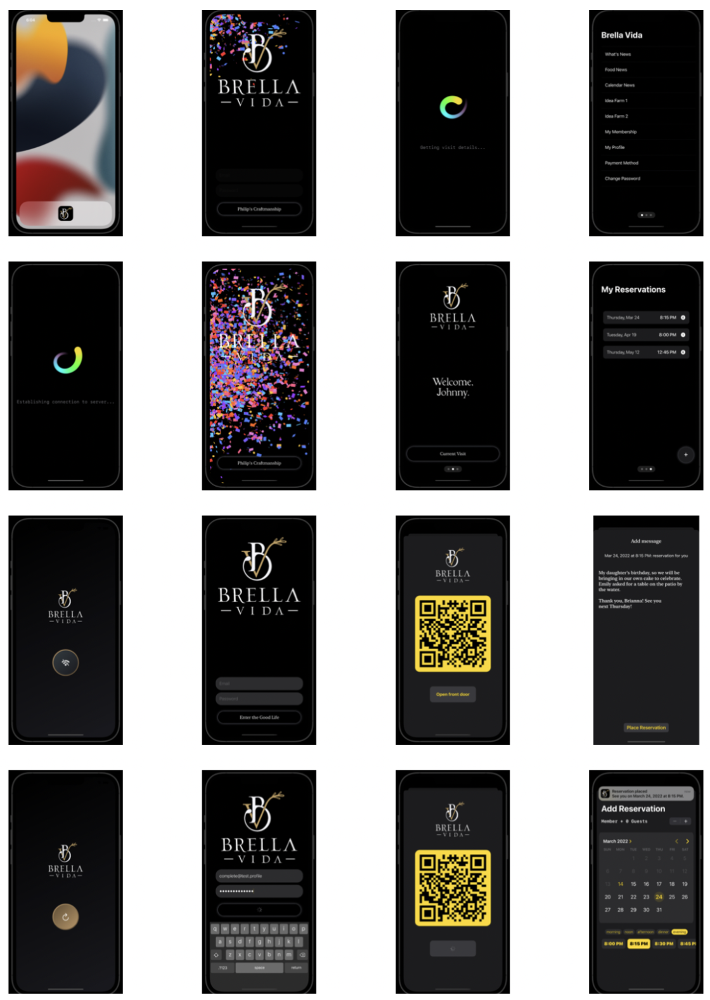

# CS 455 Final Project: React Native App


**Welcome to my final project for CS 455: Mobile Computing.**
This project evaluates the creation of a mobile application in React Native.

## Take Aim: Defining Project Scope

CS 455 specializes on the design and implementation of software in a networked mobile environment, focusing on the challenges and opportunities afforded by modern mobile computing devices. The primary topics included software development practices, network computing, graphics programming, and human-computer interaction. CS 335 (Computer Networks) and CS 340 (Advanced Algorithm Design) are prerequisites for this course.

**This project is to be evaluated according to three goals and eight expectations:**

Goals
1. Demonstrate knowledge in a form that can be evaluated.
2. Practice what has been learned in a 'real world' format.
3. Extend knowledge and abilities past what has been shown in class.

Expectations
1. The project should be of sufficient complexity to require documentation.
2. The majority of this project mark is based on the github “README” file.
3. A specific software design pattern must be chosen, documented, and implemented.
4. Follow mobile programming best practices.
5. Mind naming conventions -- variables should describe what values they represent.
6. Respect the usual data encapsulation and modular object-oriented design etiquette.
7. Exclude libraries and variables that are not required – clean-up after yourself!
8. Comment your code! No matter how self-documenting, your code requires annotation!


## Table of Contents

1. [BVxAndroid v0.5](#BVxAndroid)
   1. [Acknowledgements](#acknowledgements)
   2. [Bibliography](#further-reading)
   3. [Developer Contact](#contact-the-developer)
   4. [Contribute](#contribute)
   5. [License](#license)
2. [Instructions](#instructions)
   1. [File Manifest](#file-manifest)
   2. [Configuration](#configuration)
   3. [Installation](#installation)
   4. [Usage](#usage)
3. [Next Steps](#next-steps)
   1. [SwiftUI Screenshots](#SwiftUI-demo)
   2. [Known Bugs](#known-bugs)
   3. [Milestones](#milestones)
   4. [Project Status](#project-status)


## BVxAndroid

In 2021, I developed and sold a native iOS application using the SwiftUI framework.

Using my existing graphQL server backend, I intend to port an ultra-low-quality version of the app to React Native, to enable basic facility access for Non-Apple users of my client's business. Since this implementation will exclude major functionality currently available in version 1.0, it will assume version number 0.5. Since my project does not welcome open-source contributions, public feedback will be limited to bug discovery and reporting.

The design pattern implemented for this project is a modified MVVM pattern, based on the principle of composition. The GraphQL queries provide the data model used throughout the app.


### Acknowledgements
The exclusive author, designer and developer of the original SwiftUI project is Ottenbreit Tech.

Many thanks to
- the documentation team at Apple for teaching me Mobile Computing;
- the SwiftUI team for their commitment to clean code excellence;
- HackingWithSwift's Paul Hudson for providing bleeding edge SwiftUI tutorials;
- the documentation team at GraphQL for providing environment-specific code samples which enabled my 3 hour port of this project;
- the University of Regina's Trevor Tomesh for introducing me to code-level React Native development.


### Further Reading
 - [A sample of good github documentation](https://github.com/matiassingers/awesome-readme)
 - [A sample of good github documentation](https://github.com/matiassingers/awesome-readme)


### Contact The Developer
To contact the me [check out my website](https://ottenbreit.tech).
For troubleshooting, refer to [my installation instructions](#installation) and [the expo documentation](https://docs.expo.dev).


### Contribute
To contribute to this project, request access to the private [configuration](#configuration) files.
Report issues on Github or using this [Google Form](https://forms.gle/bE8ciqi2KJqCc1bN8).


### License

 - All business knowledge associated with this project is proprietary intellectual property.
 - The files made available in this repository are licensed under the MIT License.

Copyright (c) [2022] [Ottenbreit Tech]

Permission is hereby granted, free of charge, to any person obtaining a copy
of this software and associated documentation files (the "Software"), to deal
in the Software without restriction, including without limitation the rights
to use, copy, modify, merge, publish, distribute, sublicense, and/or sell
copies of the Software, and to permit persons to whom the Software is
furnished to do so, subject to the following conditions:

The above copyright notice and this permission notice shall be included in all
copies or substantial portions of the Software.

THE SOFTWARE IS PROVIDED "AS IS", WITHOUT WARRANTY OF ANY KIND, EXPRESS OR
IMPLIED, INCLUDING BUT NOT LIMITED TO THE WARRANTIES OF MERCHANTABILITY,
FITNESS FOR A PARTICULAR PURPOSE AND NONINFRINGEMENT. IN NO EVENT SHALL THE
AUTHORS OR COPYRIGHT HOLDERS BE LIABLE FOR ANY CLAIM, DAMAGES OR OTHER
LIABILITY, WHETHER IN AN ACTION OF CONTRACT, TORT OR OTHERWISE, ARISING FROM,
OUT OF OR IN CONNECTION WITH THE SOFTWARE OR THE USE OR OTHER DEALINGS IN THE
SOFTWARE.


## Instructions


### File Manifest
```
- README.md ---------> This markdown file you are reading.
- README_img --------> Images folder for the readme.
```


### Configuration
Due to the public nature of this repository, I will not name my client nor identifying information regarding their work. The excluded SERVER_URL string constant and gql statements are required to build this app and can be made available privately upon request, for evaluation purposes.


### Installation

troubleshooting tips

- Describe how your software / development is installed. Sometimes it's easy as something like:

```bash
sudo apt-get install my-cool-thing
```

- often it involves a bit of  downloading sources and building:

```bash
git clone my-cool-repo.git
cd /my-cool-repo
cd /build
make
```

- You should list out steps as unambiguously as humanly possible!!
- Often people don't read the actual install instructions, but they just copy and paste what is in the black boxes. __Keep this in mind!__


### Usage
- Describe how the program / project is going to be used once it is installed. 
- If it is a command line app, you'll want to give CLI examples:

```bash
cool-project -arg1 -arg2
```

- then maybe show a screenshot of  the results :smile:


## Next Steps


### Known Bugs


### Milestones
- [x] App Class With Context Provider & Navigation
- [ ] GraphQL Client
- [ ] SignIn & Client Authorization
- [ ] SignIn Persistence & App Storage
- [ ] Home Screen with StartVisit/CurrentVisit Button, Member Name
- [ ] Left Panel Sidebar with Authorized Webviews
- [ ] 
- [ ] 

### SwiftUI Demo
Screenshots from the SwiftUI App that is being ported to React Native.




### Project Status

- This project is continuing under private development.
- This project is currently paused while we explore alternatives to React Native due to the weakness of JavaScript.

